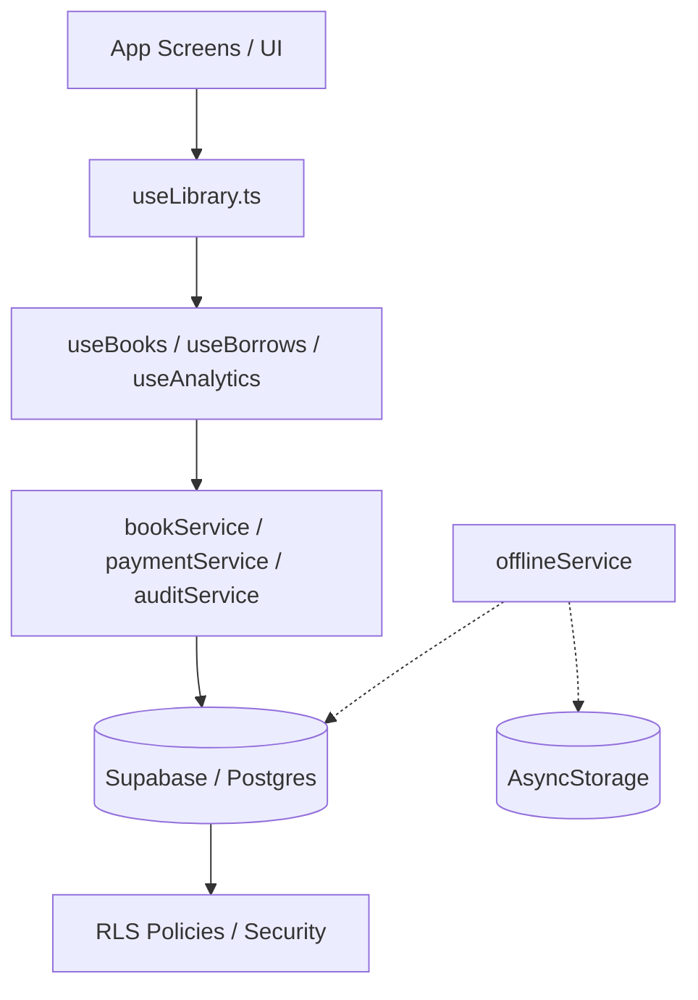

# BiblioTech v2.0 Premium - Master Technical Blueprint

This document provides a comprehensive, detailed breakdown of the BiblioTech platform, covering every technology, technique, and architectural principle implemented from inception to Phase 7.

## 1. Core Vision & System Overview
BiblioTech is a "Phygital" (Physical + Digital) library management ecosystem designed for modern, social, and inclusive reading experiences. It bridges physical book inventory with digital audiobook streaming and social community engagement.

---

## 2. Technology Stack (The Foundation)

| Layer | Technology | Rationale |
|-------|------------|-----------|
| **Frontend** | React Native (Expo) | Cross-platform (iOS/Android) with native performance. |
| **Language** | TypeScript | Strong typing for complex business logic and state. |
| **Backend/DB** | Supabase (PostgreSQL) | Real-time capabilities, built-in Auth, and PostgREST. |
| **ORM** | Prisma | Schema management and type-safe database queries. |
| **State Mgmt** | React Query (TanStack) | Server-state management with caching and optimistic updates. |
| **Persistence** | AsyncStorage | Offline data storage and media playback position. |
| **Animations** | Reanimated 2/3 | 60FPS fluid UI transitions and micro-animations. |
| **Haptics** | Expo Haptics | Tactile feedback for premium user experience. |
| **i18n** | i18next | Multi-language support (English/Vietnamese). |

---

## 3. Architectural Principles (Linkage & Flow)

### A. The Gateway Pattern (`useLibrary.ts`)
- **Principle**: All UI components consume a single unified hook `useLibrary()`.
- **Linkage**: `useLibrary` aggregates specialized hooks (`useBooks`, `useBorrows`, `useStaff`, etc.).
- **Benefit**: UI components are decoupled from the specific implementation details of services. If we change Supabase to another provider, we only update the hooks, not the 50+ UI files.

### B. Service-Driven Logic (`src/services/`)
- **Principle**: Business logic is extracted from UI and Hooks into pure services.
- **Key Files**: 
  - `bookService.ts`: External metadata fetching (Google/OpenLib).
  - `logisticsService.ts`: AI redistribution and branch transfers.
  - `paymentService.ts`: HMAC signing and VietQR generation.
  - `offlineService.ts`: Action queueing and data syncing.

### C. Database Security (RLS)
- **Principle**: Security is enforced at the database level, not just the client.
- **Implementation**: Row Level Security (RLS) policies in PostgreSQL ensure Members cannot see Audit Logs, and Librarians can only manage their assigned branches.

---

## 4. Functionality & Technical Mapping

### 🔵 Metadata & Discovery (Làn 1-4)
- **Functions**: Barcode scanning, AI-driven book data enrichment.
- **Techniques**: 
  - **Fuzzy Search**: Implemented via Postgres `pg_trgm`.
  - **Semantic Search**: Vector embeddings stored in `pgvector`.
- **Files**: `src/services/bookService.ts`, `app/(tabs)/search.tsx`.

### 🔵 Offline Resilience (Làn 5)
- **Functions**: Browsing catalog and queuing borrow requests without internet.
- **Techniques**: 
  - **Action Queueing**: Store failed mutations in `AsyncStorage` and retry on reconnect.
  - **Delta Syncing**: Only fetch changes since last sync timestamp.
- **Files**: `src/services/offlineService.ts`, `src/hooks/library/useOffline.ts`.

### 🔵 Social Annotation Layer (Làn 18)
- **Functions**: Collaborative highlights and margin notes on book pages.
- **Techniques**: 
  - **Real-time Presence**: Using Supabase Broadcast to see "Who's reading now".
  - **Optimistic UI**: Update note list locally before DB confirmation.
- **Files**: `src/components/AnnotationLayer.tsx`, `src/hooks/library/useAnnotations.ts`.

### 🔵 Deep Analytics & Logistics (Làn 15 & 17)
- **Functions**: Heatmaps, member retention, and inter-branch book transfers.
- **Techniques**: 
  - **Postgres RPCs**: Complex aggregations handled via `supabase.rpc`.
  - **AI Suggestions**: Node.js Edge Functions for inventory intelligence.
- **Files**: `app/(librarian)/insights.tsx`, `src/services/logisticsService.ts`.

### 🔵 Advanced Media Player (Làn 16)
- **Functions**: Audiobook player with sleep timer and speed control.
- **Techniques**: 
  - **Persistent Playback**: Save timestamp every 5 seconds to `AsyncStorage`.
  - **Audio Session**: Managing background audio focus.
- **Files**: `src/components/AudioPlayer.tsx`, `src/hooks/library/useAudiobooks.ts`.

---

## 5. File Relationship Matrix

## 6. Enterprise Hardening (Phase 7)

### ✅ Multi-Language (Làn 21)
- **File**: `src/i18n/index.ts`, `src/i18n/locales/*.json`.
- **Technique**: Component-level translation with `t('key')`.

### ✅ Security Audit (Làn 23)
- **File**: `src/services/auditService.ts`, `app/(admin)/audit.tsx`.
- **Technique**: Trigger-based logging of sensitive mutations (Delete, Appoint, Approve).

### ✅ Layout Globalization
- **File**: `app/(member)/_layout.tsx`, `app/(librarian)/_layout.tsx`, `app/(admin)/_layout.tsx`.
- **Technique**: Dynamic tab titles and headers using `react-i18next`.

---

## 7. Optimization Summary
- **Consolidated Analytics**: Merged legacy librarian trends into `useAnalytics.ts`.
- **Atomic Components**: Replaced duplicate UI code with reusable `StatCard` and `StatusBadge`.
- **Query Optimization**: Added `staleTime` and `cacheTime` to heavy analytical queries to reduce DB load.

**Author**: Antigravity AI  
**Date**: 2026-04-28  
**Status**: Phase 7 - 50% Complete (Clean & Unified)
